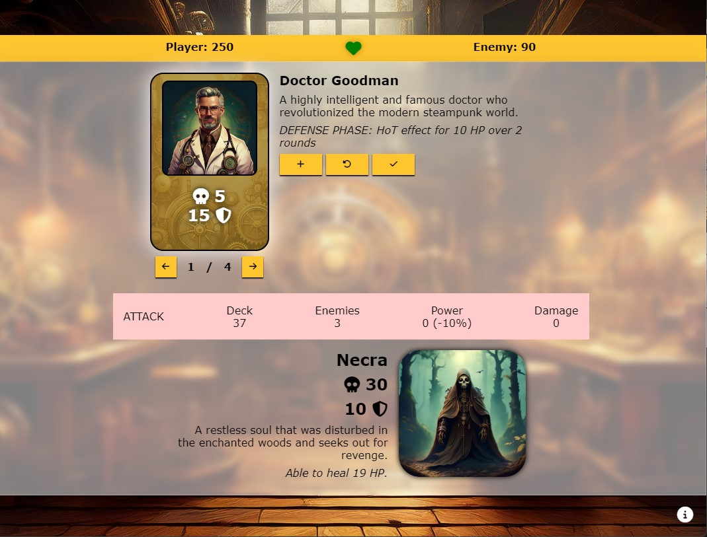

# Steampunk Struggle
Steampunk Struggle is a fantasy card game that takes place in a fictional steampunk world. It features different cards, enemies and combat phases. Strategic combat planning is one of the key aspects of the game.

The live page can be viewed here: [Link to Steampunk Struggle](https://ci-dominik.github.io/pp2-card-battle/ "Link to the live website")

## **TABLE OF CONTENTS**

[**USER EXPERIENCE**](#user-experience)
  * [----------](#----------)
    
 

[**FEATURES**](#features)
  * [----------](#----------)

 

[**FEATURES EXPLAINED**](#features-explained)
  * [----------](#----------)
    
 

[**DESIGN**](#design)
  * [Colour choice](#colour-choice)
  * [Wireframes](#wireframes)
    
 

[**TECHNOLOGIES**](#technologies)
  * [HTML](#html)
  * [CSS](#css)
  * [JavaScript](#javascript)
  * [Visual Studio Code](#visual-studio-code)
  * [GitHub](#github)
  * [Adobe Photoshop](#adobe-photoshop)
  * [Fontawesome](#fontawesome)
    
 

[**TESTING**](#testing)
  * [Responsiveness](#responsiveness)
  * [Manual testing](#manual-testing)
    * [Starting the game](#starting-the-game)
    * [Attack phase](#attack-phase)
    * [Defense phase](#defense-phase)
    * [Phase summary](#phase-summary)
    * [Enemy defeated](#enemy-defeated)
    * [Game won](#game-won)
    * [Game lost due to lack of health points](#game-lost-due-to-lack-of-health-points)
    * [Game lost due to lack of cards](#game-lost-due-to-lack-of-cards)
    
 

[**VALIDATOR TESTING**](#validator-testing)
  * [HTML validator](#html-validator)
  * [CSS validator](#css-validator)
  * [JavaScript validator (scripts.js)](#javascript-validator-scriptsjs)
  * [JavaScript validator (Card.js)](#javascript-validator-cardjs)
  * [JavaScript validator (Enemy.js)](#javascript-validator-enemyjs)
  * [JavaScript validator (Skill.js)](#javascript-validator-skilljs)

 

[**USED PLATFORMS AND DEVICES**](#used-platforms-and-devices)
  * [Browsers](#browsers)
  * [Smartphones](#smartphones)

 

[**BUGS**](#bugs)
  * [Unfixed bugs](#unfixed-bugs)
  * [Fixed bugs](#fixed-bugs)

 

[**ACCESSIBILTIY**](#accessibility)
  * [Lighthouse testing](#lighthouse-testing)
  * [WAVE extension](#wave-extension)
  * [Use of font sizes](#use-of-font-sizes)
  * [Goal of accessibility measures](#goal-of-accessibility-measures)
    
 

[**DEPLOYMENT**](#deployment)
  * [Visual Studio Code connection](#visual-studio-code-connection)
  * [Cloning, commitig and pushing via Visual Studio Code](#cloning-commiting-and-pushing-via-visual-studio-code)
  * [Deployment via GitHub Pages](#deployment-via-github-pages)
    
 

[**CREDITS**](#credits)
  * [Fontawesome](#fontawesome-1)
  * [Techsini](#techsini)
  * [HTML validator](#html-validator-1)
  * [CSS validator](#css-validator-1)
  * [JavaScript validator](#javascript-validator-1)
  * [W3Schools](#w3schools)
  * [YouTube](#youtube)
  * [Adobe Firefly](#adobe-firefly)
  * [Visual Studio Code](#visual-studio-code-1)

## **USER EXPERIENCE**

## Target audience
* PH

## User's journey
* PH

## Intuitive and consistent design
* PH

---

## **FEATURES**

## FEATURE X
* PH

 

 

## 404 page
* PH

 

---

## **FEATURES EXPLAINED**

## Existing

### FEATURE 1
* PH

### FEATURE 2
* PH

## Upcoming

### FEATURE 1
* PH

### FEATURE 2
* PH

---

## **DESIGN**

## Colour choice
* The overarching colour is #FFC52F, as steampunk architecture and steam-powered machines commonly get associated with a darker yellow. It fits nicely to the background that supports the battlefield for the player's cards and the enemies. 
The white background delivers enough contrast to the machinery and is itself contrasted with the black letters used in the battlefield area.  Mint green and Tea rose (red) are used for displaying the current combat phase as red gets associated with conflict and the green colour represents defense and restraint.

 

## Wireframes

* Mobile view

 

* Desktop view

---

## **TECHNOLOGIES**

### HTML
* HTML (HyperText Markup Language) was used to create the structure of the homepage.

### CSS
* All styled were applied by using and linking a CSS (Cascading Style Sheet) file.

### JavaScript
* JavaScript was used to create the functionality of the homepage.

### Visual Studio Code
* Visual Studio Code was used to clone the GitHub repository, edit the homepage's code and commit / push the results to GitHub.

### GitHub
* GitHub was used to store the homepage's files. Everything was deployed using GitHub Pages.

### Adobe Photoshop
* Adobe Photoshop was used to create content images and wireframes.

### Fontawesome
* Fontawesome was linked in the homepage's code to include icon files.

---

## **TESTING**

## Responsiveness

|Testing method | Expected result | Actual result |
|:-------------:|:---------------:|:-------------:|
| TEXT1	| TEXT2 | TEXT 3 |

## Manual testing

### Starting the game

|Testing method | Expected result | Actual result |
|:-------------:|:---------------:|:-------------:|
| Clicking on close button of help popup | Window should close down | Expected result achieved |
| Clicking outside of the help popup | Window should close down | Expected result achieved |
| Clicking inside of the help popup | Window should stay in place | Expected result achieved |

 

### Attack phase

|Testing method | Expected result | Actual result |
|:-------------:|:---------------:|:-------------:|
| Looking for starting phase | Game should start in attack phase | Expected result achieved |
| Click on scroll buttons | Four cards should get added to the hand and they should be scrollable | Expected result achieved |
| Click on add button | Cards should get subtracted from the player's hand | Expected result achieved |
| Look at power value | Power value should increase according to card's attack value | Expected result achieved |
| Look at damage value | Power should get subtracted by the enemy's defense value in percent | Expected result achieved |
| Click on undo button without a card added to stack | Nothing should happen | Expected result achieved |
| Click on undo button with card added to stack | Card should get added back to hand | Expected result achieved |
| Check deck amount | There should be 36 cards left in deck to draw | Expected result achieved |
| Check enemy amount | There should be three enemies in total | Expected result achieved |
| Click on fight button with cards added to attack stack | Effects should be applied and damage should be done to enemy | Expected result achieved |
| Play all left cards | Image should change to no cards left | Expected result achieved |

 

### Defense phase

|Testing method | Expected result | Actual result |
|:-------------:|:---------------:|:-------------:|
| Check if power value changed | Power value of enemy should be displayed | Expected result achieved |
| Add cards to defense stack | Power value should be subtracted by the combined defense value in percent | Expected result achieved |
| Check if damage number gets updated | Damage should be the result of Power minus defense values | Expected result achieved |
| Click on fight button with cards added to defense stack | Effects should be applied and damage should be done to player | Expected result achieved |
| Play all left cards | Image should change to no cards left | Expected result achieved |

 

### Phase summary

|Testing method | Expected result | Actual result |
|:-------------:|:---------------:|:-------------:|
| Checking if every action was used | Enemy and player effects should be present | Expected result achieved |
| Checking for damage | Damage should be displayed and subtracted from enemy or player | Expected result achieved |
| Clicking on next phase button after attack phase | Window should close down and next phase should start | Expected result achieved |
| Clicking on next phase button after defense phase | Window should close down, next phase should start and new cards should be drawn | Expected result achieved |

 

### Enemy defeated

|Testing method | Expected result | Actual result |
|:-------------:|:---------------:|:-------------:|
| Checking phase summary | Enemy defeat should be noted | Expected result achieved |
| Check for new enemy | New enemy should get added if one is present | Expected result achieved |

 

### Game won

|Testing method | Expected result | Actual result |
|:-------------:|:---------------:|:-------------:|
| Defeat last enemy with cards left in deck | Win popup should appear | Expected result achieved |
| Defeat last enemy with no cards left in deck | Win popup should appear | Expected result achieved |
| Click on new game button | Page should reload and a new game should start | Expected result achieved |
| Defeat enemy with DoT effect | Win popup should appear | Expected result achieved |
| Check for enemy values | Values should be reset | Expected result achieved |

 

### Game lost due to lack of health points

|Testing method | Expected result | Actual result |
|:-------------:|:---------------:|:-------------:|
| Lose all health points | Defeat popup should appear | Expected result achieved |
| Lose all health points due to DoT effect | Defeat popup should apprear | Expected result achieved |

 

### Game lost due to lack of cards

|Testing method | Expected result | Actual result |
|:-------------:|:---------------:|:-------------:|
| Play all left cards during attack phase | Defeat popup should appear | Expected result achieved |
| Play all left cards during defense phase | Defeat popup should appear | Expected result achieved |

 

---

## **VALIDATOR TESTING**

### HTML validator
* All pages were checked for their HTML structure by the W3C Markup Validation Service. No document showed any errors.

 

### CSS validator
* The stylesheet file was checked via the W3C CSS Validation Service. No errors were found.

 

### JavaScript validator (scripts.js)
* The JavaScript validator caught errors which are almost exclusively related to usage in another document like in a HTML button with an onclick event. Variable i used in line 48 just got used to iterate over an array as long as the player's hand is not filled with cards.

### JavaScript validator (Card.js)
* The JavaScript validator caught one error related to the usage of the function loadAvailableCards(). This was called in scripts.js.

### JavaScript validator (Enemy.js)
* The JavaScript validator caught one error related to the usage of the function loadEnemies(). This was called in scripts.js.

### JavaScript validator (Skill.js)
* The JavaScript validator caught three errors related to the usage of the classes Dot, Stun and Hot. Those were called in scripts.js.

---

## **USED PLATFORMS AND DEVICES**

## Browsers
* Google Chrome
* Mozilla Firefox
* Microsoft Edge

## Smartphones
* Poco F5 Pro
* Samsung S21
* Samsung S23
* iPhone XS

## **BUGS**

## Unfixed bugs
* When adding cards to the attack or defense stack, Mozilla Firefox sometimes increases the height of the battlefield. This bug was recreateable but not fixable for the author at the time of deployment.

## Fixed bugs
* PH

---

## **ACCESSIBILITY**

## Lighthouse testing
* Lighthouse testing was used to determine the site's performance, accessibility, best practices and SEO. Special emphasis was layed on performance and accessibility to provide a great user experience for every visitor, no matter the device or conditions. 
The performance rating on mobile devices gave varying results between 84% and 99%, depending on the run. This is because of the largest contentful paint and needs to be addressed in the future for more stable results. 
The results for desktop view were perfect in every category.

  

  

**404 page**

  

## WAVE extension
* The WAVE extension was used to determine errors on the homepage that could lead to a worse user experience. Only some alerts were found stating that some elements may be potential headings. This is due to the usage of a big font-sizes on some elements that are buttons or other non-heading elements.

 

## Use of font sizes
* Throughout the whole homepage, every element was sized using the rem unit. This way, it is ensured that the experience is the same on any font size setting of the browser. The unit was used to give people who cannot read small texts a better time and feel included.

## Goal of accessibility measures

* Everyone should be able to enjoy the website content, so an alt tag was added to every picture to describe it. 
In addition to this, aria labels were added to all buttons to describe their behaviour. 
This way, every screen reader should be able to pick of the provided content. 
Lastly, the colours of the homepage were chosen to ensure enough contrast for visually impaired users.

---

## **DEPLOYMENT**

## Visual Studio Code connection
* A connection between Visual Studio Code and GitHub was established using the built-in function to include the ability to clone, stage, commit and push content directly to GitHub.
Once you start Visual Studio Code with no connection, you simply need to click on the person icon in the lower left corner and select "GitHub". From there, you can connect your existing account to Visual Studio Code.

 

## Cloning, commiting and pushing via Visual Studio Code
* Visual Studio code was used to stage all changed files and commit them with an included message directly to GitHub.

 

## Deployment via GitHub Pages
* Once a version that should be visible on the internet has been established, to deploy a page, one needs to visit the GitHub repository that is used to store all data of the project.

 

On the top, there is an option that says *Settings*. In this menu, it is possible to deploy the page using the *Pages* sub-menu.

 

Once one clicks on the *Pages* sub-menu, a new page will appear. On this one, one can select the branch of the project which contains the main data to deploy to GitHub Pages. In this case, the branch *Main* was used.

 

With the right branch selected, the input needs to be saved via the *Save* button.

 

After the deployment, a link to the deployed page can be found on the frontpage of the GitHub repository. With a click on it to reveal the link that takes the visitor to the live page.

 

---

## **CREDITS**

## [Fontawesome](https://fontawesome.com/)
* Used to implement website icons.

## [Techsini](https://techsini.com/multi-mockup/index.php)
* Used to create the mockup in the readme file.

## [HTML validator](https://validator.w3.org/)
* Used to verify HTML code.

## [CSS validator](https://jigsaw.w3.org/css-validator/)
* Used to verify CSS code.

## [JavaScript validator](https://jshint.com/)
* Used to verify JavaScript code.

## [W3Schools](https://www.w3schools.com/)
* Used to lookup tips for the code.

## [Favicon Generator](https://realfavicongenerator.net/)
* Used to generate favicons for the homepage.

## [YouTube](https://youtube.com)
* Videos for understanding some code areas.

## [Adobe Firefly](https://firefly.adobe.com/)
* Used to generate the images for the game's cards and enemies.

## [CSS glassmorphism generator](https://css.glass/)
* Used for the glass effect of the battlefield background.

## Visual Studio Code
* Used to generate HTML boilerplate code.